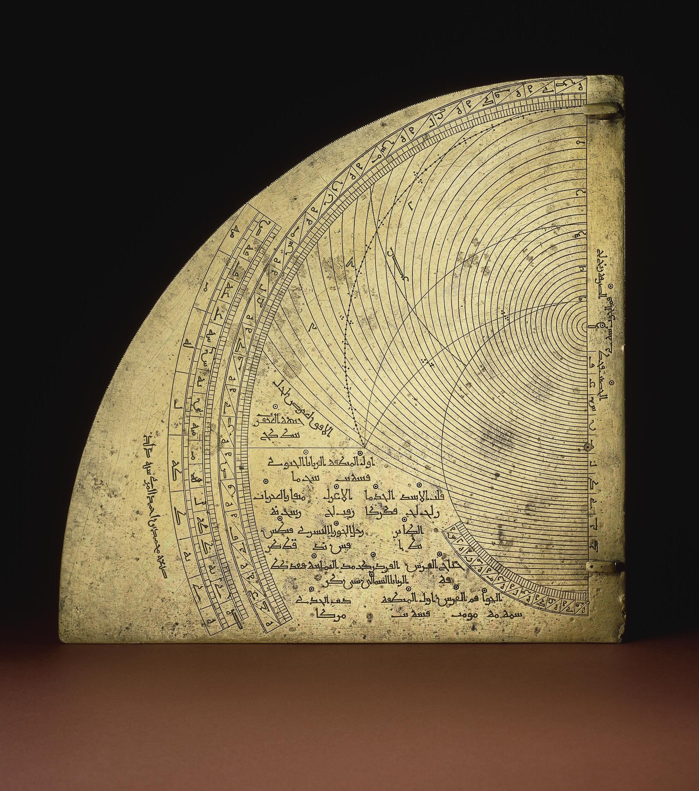
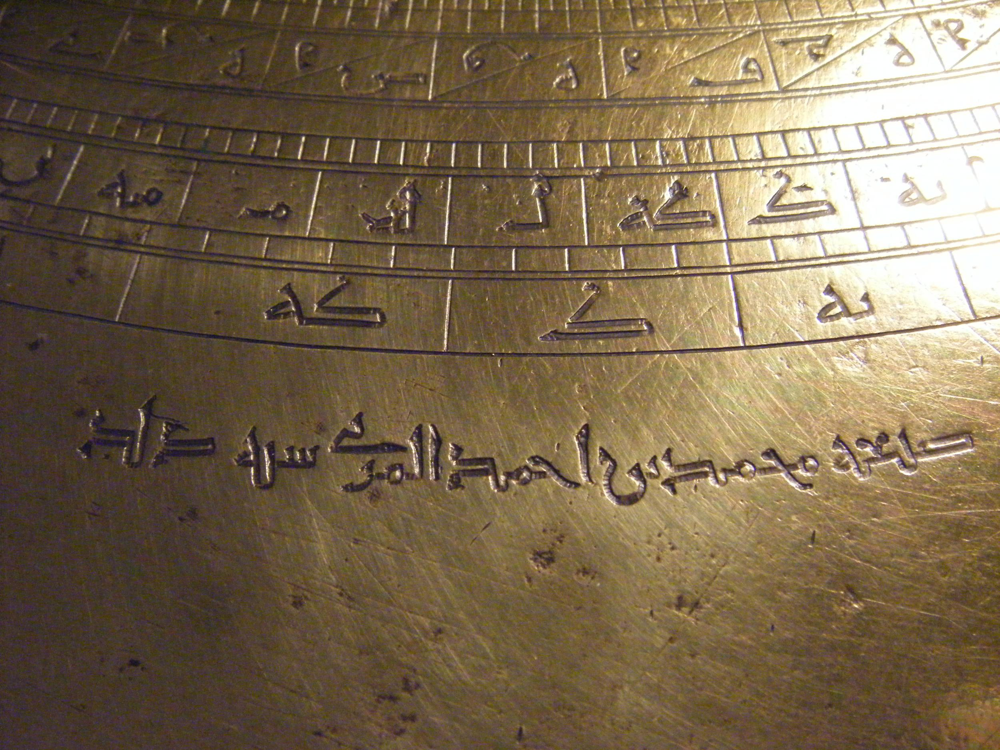
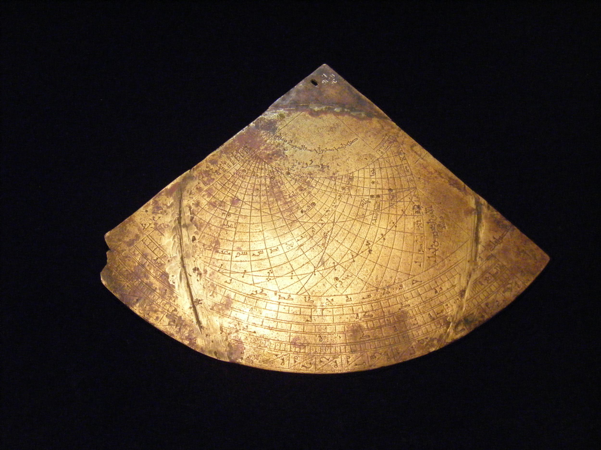

# al-Mizzi
https://islamsci.mcgill.ca/RASI/BEA/Mizzi_BEA.htm

## Astrolabe quadrant
https://www.davidmus.dk/islamic-art/mechanics-astronomy-and-astrology/item/1616?culture=en-us:

## Astrolabe quadrant
https://www.britishmuseum.org/collection/object/W_1888-1201-276

## Astrolabe quadrant
https://www.britishmuseum.org/collection/object/W_1835-1116-1

# Others

## Astrolabe by Muhammad ibn Jafar ibn Umar al-Asturlabi
https://www.davidmus.dk/kunst-fra-islams-verden/metal-vaben-og-smykker/item/884?culture=en-us

https://www.metmuseum.org/art/collection/search/444408

## Astrolabe quadrant by Muhammad al-Sakasi al-Jarkasi
https://www.britishmuseum.org/collection/object/W_1997-0210-1

## Astrolabe quadrant by Ali ben ash-Shihab
https://www.britishmuseum.org/collection/object/W_1862-1227-1

## Fragment of a box with a combination lock
https://www.davidmus.dk/kunst-fra-islams-verden/metal-vaben-og-smykker/item/1480?culture=en-us

